Repo: solar

```
pip install -U torch numpy pandas matplotlib torchviz scikit-learn tensorboard torchvision tqdm torch-lr-finder ipyplot ipywidgets opencv-python torchmetrics
yes | conda install -c conda-forge jupyter_contrib_nbextensions graphviz python-graphviz
```

Goal of this project is to deliver segmentation masks of solar panel farms 
using satellite images. Due to large varieties of the images, I decided to use deep segmentation/PyTorch. 

# Data 

Data preparation/cleaning was intensive. Most labels were provided thought quality was not ideal. Nevertheless, 
I am grateful for what seems to have been a painful labeling job. I also generated some labels 
using [LabelMe](https://github.com/wkentaro/labelme). 
I first split several large (~1GB) satellite images into smaller ones (256x256 size). 
There were 449 labels of 3 classes: racks, common panels, and dense panels:

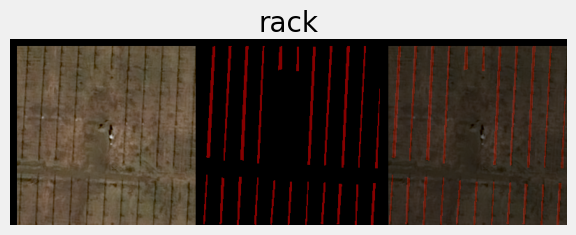
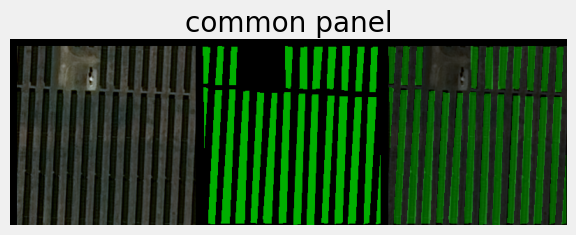
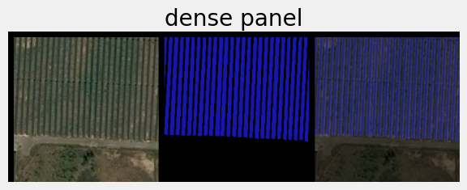

# Augmentation

It was insightful to plot mean and standard deviation of labeled and unlabeled images to identified range for 
ColorJitter as augmentation:
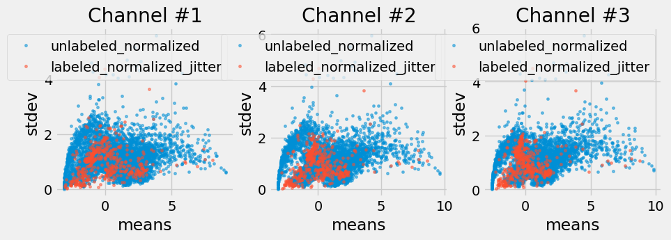

Labeled and unlabeled data have decent overlap, with non-covered datapoints typically being clouds 
(high mean, low stdev) or with partial out-of-bounds, i.e. black, zones (low mean). 
See `main_experimentation.py` for examples. 

# Training

I used `Adam` optimizer and weighed `CrossEntropyLoss`. Segmentation was based on UNet-like arhitecture 
and [this](https://arxiv.org/abs/1505.04366) paper (see models.py):

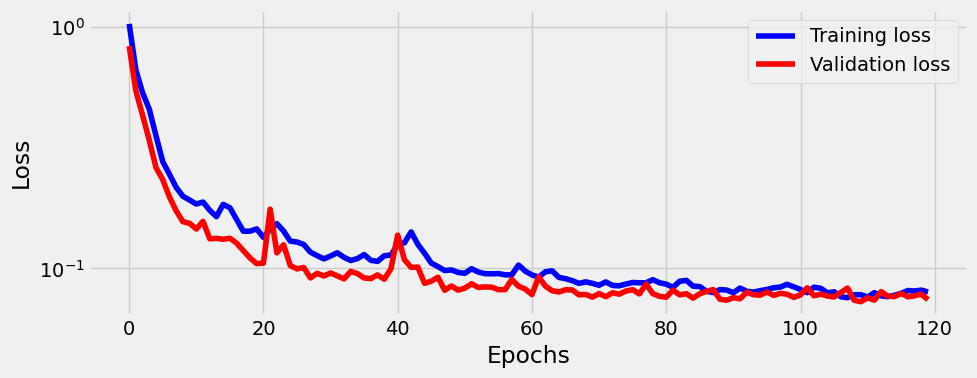

Training for 120 epoch took about 6 minutes (RTX5000). Achieved 71% Jaccard index (aka IoU) on validation dataset.

# Inference

Finally, I evaluated and stitched together predicted images back into large satellite images (size ~1Gb, 
showing here only smaller section):

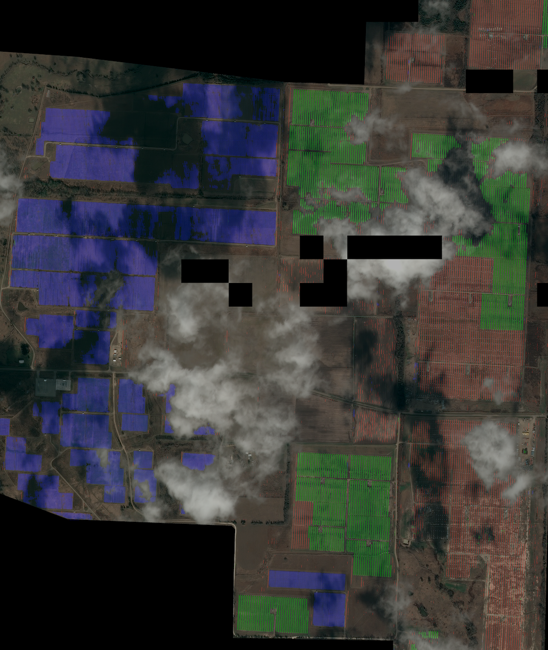

(Note: some missing patches in the image were used for training).

**Shadows and clouds are probably the biggest obstacle for precise counting**. While augmentations can help to some extent,
ideally multiple images of the same solar farm should be obtained and combined for thorough coverage.

The following are some notable examples.

Handling multiple classes: 

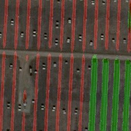 

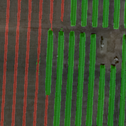
 

Handling different backgrounds:

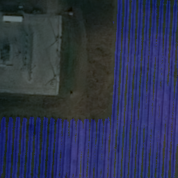 
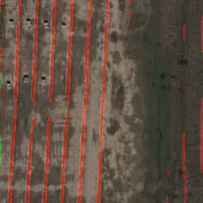
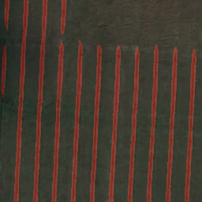
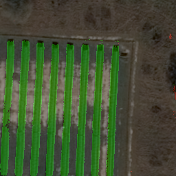 
 

And here are the common failures, mostly shades and clouds:

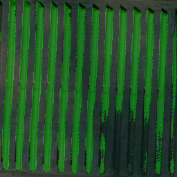 
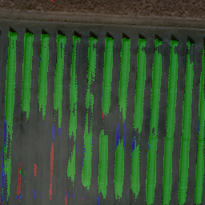
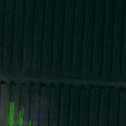
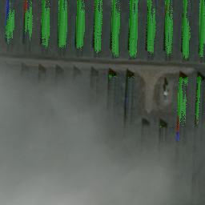 
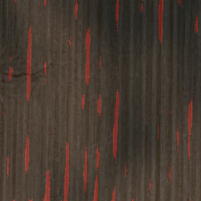
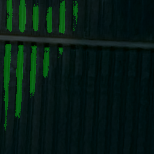
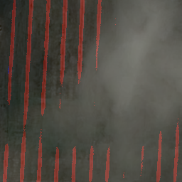

# Future work

Augmentation is by no means thoroughly explored and one can explore more of it. This could improve detection is shadowed 
areas. In addition, shape of the solar panels is distinct (long, rectangular) and some post-processing can be applied 
to remove noise.

Once could evaluate number of solar panels as means of tracking the progress of solar farm construction. 
We know that pixel resolution is 50cm/pixel, the panels have about 40 inches (101.6 cm, or 2 pixel) width.

Small edge improvements can be done by allowing for some overlap when cropping large images. 
Once segmentation is done we can combine the masks and the edge effect will disappear.
