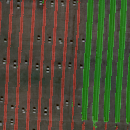
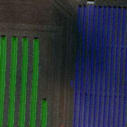

Repo: solar

```
pip install -U torch numpy pandas matplotlib torchviz scikit-learn tensorboard torchvision tqdm torch-lr-finder ipyplot ipywidgets opencv-python torchmetrics
yes | conda install -c conda-forge jupyter_contrib_nbextensions graphviz python-graphviz
```

Goal of this project is to deliver segmentation masks of solar panel farms 
using satellite images. Due to large varieties of the images, I decided to use deep segmentation/PyTorch. 

Data preparation/cleaning was intensive. Most labels were provided thought quality was not ideal. Nevertheless were greatful 
for what seems to have been a painstaking labeling job (I generated some labels using [LabelMe](https://github.com/wkentaro/labelme)).

I first split several large (1GB) satellite images into smaller ones. 
It was insightful to plot mean and standard deviation of labeled and unlabeled images to identified range for 
ColorJitter as augmentation.

I used Adam optimizer and weighed CrossEntropyLoss. Segmentation was based on UNet arhitecture.


Achieved 71% jaccard's index (i.e. IoU)

Finally, I evaluated and stitched together predicted images back into large satellite images.

Shadows and clouds are probably the biggest obstacle for precise counting. While augmentations can help to some extent,
ideally multiple images of the same solar farm should be obtained and combined for thorough coverage.

The following are some notable examples,

Handling multiple classes: 

 


 

Handling different backgrounds:

 


 
 

And here are the common failures namely shades and clouds:

 


 


# Future work

Future work includes evaluating number of solar panels (we know that pixel resolution is 50cm/pixel). 
The modules used on the Samson project are LONGi-LR4 and LONGi-LR6 which have about 40 inches (101.6 cm) width.
Small edge improvements can be done by allowing for some overlap when cropping large images. 
Once segmentation is done we can combine the masks and the edge effect should disappear.
